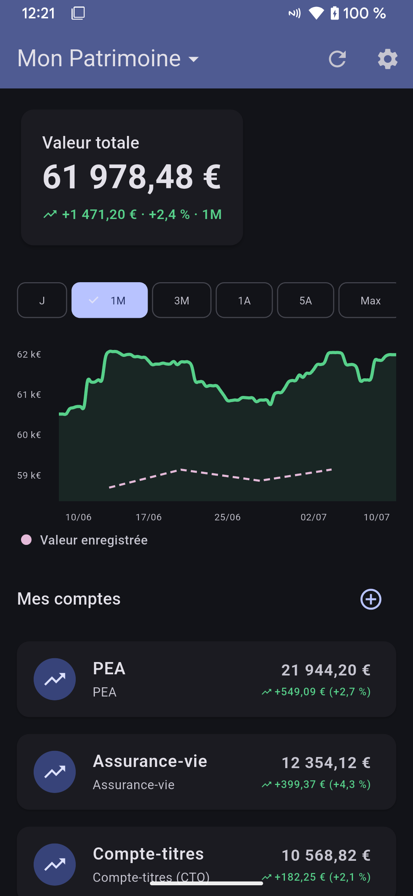
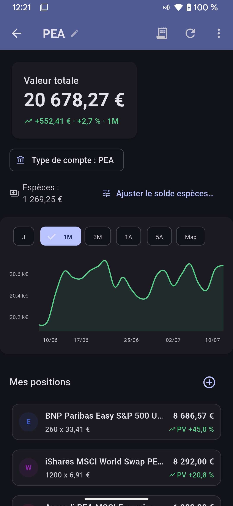
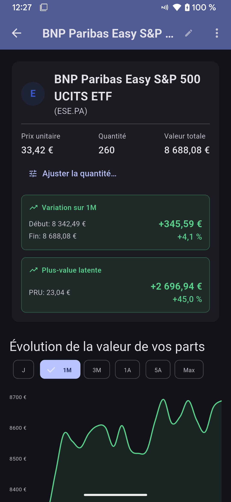
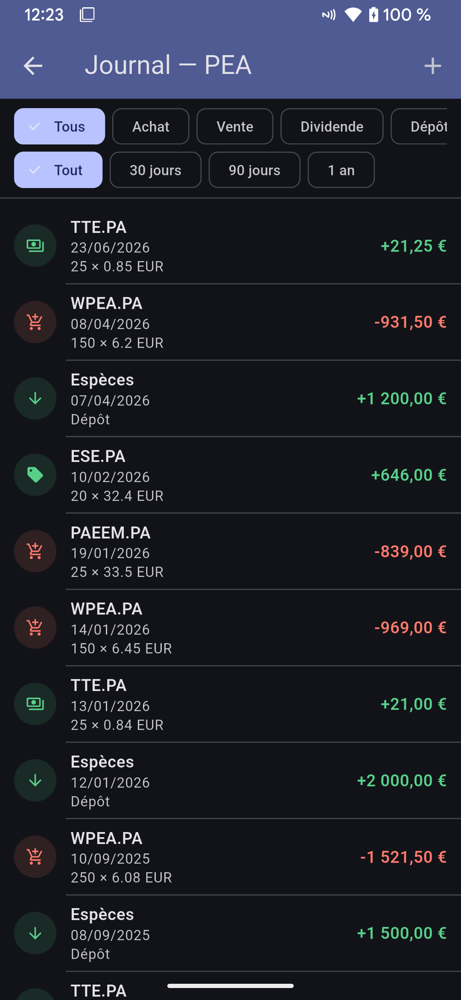
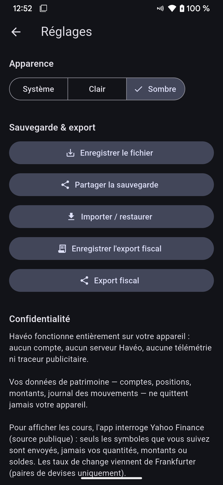

**English** · [Français](README.md)

<div align="center">

<picture>
  <source media="(prefers-color-scheme: dark)" srcset="assets/branding/wordmark_dark.png">
  
</picture>

*your accounts, your data, your device.*


**Your wealth, 100% local and private. No sign-up, no server, no API key.**

*A private, local-first net-worth tracker for French investors (PEA / CTO / Assurance Vie) and physical precious metals.*

[](https://github.com/sparneo/sparneo/network)
[](https://github.com/sparneo/sparneo/stargazers)
[](https://github.com/sparneo/sparneo/issues)

</div>

---

## 📖 About

**Sparneo** is a **100% local and private** Flutter net-worth tracking app, designed for French investors: **PEA**, **PEA-PME**, **CTO** (regular brokerage), **assurance vie**, **PEE**, **PER** tax wrappers, **crypto** and **cash** accounts, plus tracking of **physical gold and precious metals** (coins and bars) with **premium over spot** taken into account. The interface is bilingual (French / English), and stocks, ETFs, crypto and metals are quoted through worldwide symbols.

All your data stays on your device:

- 🔒 **No sign-up, no account** required.
- 🛰️ **No server**: your positions and amounts never leave your phone.
- 🔑 **No API key to configure**: quotes and exchange rates come from free, public APIs.

Data is stored locally in a **SQLite** database (`sqflite`). Market quotes are only fetched on demand, to refresh valuations.

## 🔒 Your financial data belongs to you

Personal-finance apps are among the most invasive pieces of software there are: to do their job, they see your income, your savings, your spending habits. Before adopting one, here are a few risks worth understanding — these are widespread categories of practice, with no particular company being singled out:

- **Bank aggregation.** Some apps ask for your banking credentials, or connect to your accounts through open-banking APIs. A third party then sees your entire financial life, continuously. Every extra intermediary widens the attack surface, and you depend on its security, its longevity and its future choices.
- **Data monetization.** When a hosted financial service is free, ask yourself what the real product is. A transaction history enables profiling (advertising, commercial) of formidable precision, and this kind of data feeds a whole data-broker market.
- **Third-party sharing.** Privacy policies often allow sharing with "partners" and subcontractors. That data can also be handed over to authorities upon legal request, change hands when the company is acquired, or be exposed in a breach.
- **Centralization.** A server aggregating the wealth of thousands of users is a prime target for attackers — financial data breaches are a regular occurrence, and the only data that never leaks is data that was never collected.

Sparneo reduces these risks **by design**, not by promise:

- **No data ever leaves your device.** No account, no Sparneo server, no telemetry, no trackers. Your accounts, positions, amounts and transaction history live in a local SQLite database.
- **No connection to your bank.** Sparneo never asks for banking credentials: you enter (or import) your positions yourself.
- **Minimal, anonymous network usage.** The only network calls fetch public quotes (by symbol: `AAPL`, `BTC-USD`…) and exchange rates (by currency pair, e.g. `USD→EUR`). Never your quantities, amounts or balances. The code is the proof: [`lib/services/yahoo_finance_provider.dart`](lib/services/yahoo_finance_provider.dart) and [`lib/services/exchange_rate_service.dart`](lib/services/exchange_rate_service.dart).
- **Open source (AGPL-3.0).** Everything above can be verified, line by line.

In all honesty, here is what this does **not** guarantee: quotes go through third-party APIs (Yahoo Finance, Frankfurter), which therefore see your IP address and the symbols you request — like any website you visit. And your data still needs the same protection as everything else on your device: screen lock and phone encryption, and care with the backup files you export (they contain your data in plain text and are your sole responsibility). Local-first eliminates entire categories of risk; it is not a substitute for basic digital hygiene.

## ✨ Features

- **Multiple portfolios**: manage several portfolios (e.g. "Personal", "Business") and switch between them by tapping the portfolio name at the top of the screen.
- **Accounts typed by wrapper**: CTO, PEA, PEA-PME, assurance vie, PEE, PER, crypto, cash, precious metals. The account's nature determines how it is valued (securities, balance or metal); the app performs **no tax computation whatsoever**.
- **Transaction journal** per account: nine kinds (buy, sell, dividend, deposit, withdrawal, interest, fees, opening balance, adjustment), filterable by kind and period, editable after the fact.
- **Positions derived from the journal**: quantity and **average cost basis** are projected from the transaction history (the journal is the source of truth), with **unrealized** and **realized** gains per position.
- **Cash derived from the journal**: on securities accounts, the cash balance is computed automatically from the transactions (a buy debits, a dividend credits…). Pure cash accounts remain directly editable, **multi-currency** with automatic conversion to euros.
- **Auto-detected asset type** (stock, ETF, crypto, fund…) from quote metadata, with a **manual override** available (an explicit choice is never overwritten).
- **💰 Dedicated precious-metals pricing** *(a rare, distinctive feature)*: the price of a coin or bar is derived from the spot price using
  > **unit price = spot price × fine metal weight × (1 + premium %)**

  You enter the fine weight (in grams) and the premium; the app values each unit automatically from the reference quote.
- **Interactive charts** (via `fl_chart`):
  - Value over time (whole portfolio and per account) across several periods (1D, 1M, 3M, 1Y, 5Y, Max), with real **valuation snapshots** captured during use overlaid as a dotted series.
  - Allocation by asset class (pie chart), cash included.
- **Allocation targets**: set a target percentage per asset class (and for cash) and track the **gaps** between actual and target allocation.
- **Graceful degradation**: if the network or the quote API is down, the app serves the **last known price** (persisted locally) while flagging how old the data is.
- **Backup & restore**: export and import all of your data as JSON (local file or share sheet), to back up or migrate devices. On import, declared positions are **reconciled** against the journal to guarantee consistency. A separate export of a portfolio's transaction journal, in a [documented, versioned JSON format](docs/sparneo-fiscal-export.md), completes this data portability.
- **Settings**: system / light / dark theme, privacy notice, licenses (AGPL-3.0 and dependencies).
- **Monetary precision**: journal amounts are stored and computed as **exact decimals** (never floats).
- **Bilingual FR / EN**, **Material 3** interface.

## 📸 Screenshots

<div align="center">

<table>
  <tr>
    <td align="center"></td>
    <td align="center"></td>
    <td align="center"></td>
    <td align="center"></td>
  </tr>
  <tr>
    <td align="center"><sub>Portfolio view —<br/>total value, history &amp; allocation</sub></td>
    <td align="center"><sub>Account view —<br/>positions &amp; cash of one wrapper</sub></td>
    <td align="center"><sub>Position detail —<br/>unrealized &amp; realized gains</sub></td>
    <td align="center"><sub>Journal —<br/>filterable transaction history</sub></td>
  </tr>
  <tr>
    <td align="center" colspan="4"><br/><sub>Settings —<br/>theme, backup &amp; privacy</sub></td>
  </tr>
</table>

<p><em>A clean, data-focused interface. Screenshots taken with the demo dataset below.</em></p>

</div>

> 🎬 **Demo dataset**: the file [`sample_data/demo-backup.json`](sample_data/demo-backup.json) contains the fictional portfolio of a typical French saver (~€60,000) — six accounts (**PEA**, **brokerage**, **assurance-vie**, **Livret A** savings, **crypto**, **physical gold**), fourteen positions (ETFs, stocks including a foreign-currency line, bonds, a REIT, crypto, paper gold and gold coins priced by weight and premium) and three years of journal history (~75 transactions: deposits, buys with fees, sells, dividends, interest, management fees, withdrawals, declared opening balances and adjustments), plus allocation targets and two years of valuation history. Every position matches the projection of its journal exactly (guaranteed by a dedicated test). To explore it without entering anything, open **Settings → Backup &amp; export → Import / Restore** and select this file. It is also the dataset used for the screenshots above.

## 🛠️ Tech stack

| Technology | Purpose |
|-------------|-------------|
| **Framework** | [Flutter](https://flutter.dev) (Dart SDK `^3.11`) |
| **State management** | `ChangeNotifier` controllers + `ListenableBuilder` (no Provider, no Riverpod) |
| **Storage** | SQLite (`sqflite` on mobile, `sqflite_common_ffi` on desktop) |
| **Decimal precision** | `decimal` / `rational` (exact amounts, never floats) |
| **Charts** | `fl_chart` |
| **HTTP** | `http` |
| **Logging** | `logger` |
| **Sharing / export** | `share_plus`, `file_picker`, `path_provider` |
| **i18n** | `flutter_localizations` + `gen-l10n` (EN / FR locales) |

The app primarily targets **mobile** (Android / iOS); the desktop targets (Linux, macOS, Windows) are configured and work through SQLite FFI.

### Data sources

- **Asset quotes**: [Yahoo Finance](https://finance.yahoo.com) (`query1.finance.yahoo.com/v8` endpoint).
- **Exchange rates**: [frankfurter.app](https://www.frankfurter.app).

Both APIs are **public and key-free**: nothing to configure. Only symbols and currency pairs are ever sent to them — never any of your personal financial data.

> ⚠️ **Honest note**: quotes come from Yahoo Finance's **unofficial public API**. It offers no availability guarantee and may change or stop working without notice.
>
> This API rejects clients that do not identify as a browser, so the app sends a browser User-Agent — as do the usual open-source clients of this endpoint (yfinance, yahoo-finance2 / Ghostfolio, Portfolio Performance...). Usage stays frugal: on-demand requests only, never any background polling. If the API is unavailable, the app serves the last known price while showing its date. The quote source is isolated behind a swappable interface (`MarketDataProvider`), so it can be replaced without touching the rest of the app.

## 🚀 Installation

### Prerequisites

- [Flutter SDK](https://docs.flutter.dev/get-started/install) (stable channel recommended, Dart `^3.11`)
- A code editor (VS Code, Android Studio)
- An emulator or a connected physical device

### Steps

1. **Clone the repository**
    ```bash
    git clone https://github.com/sparneo/sparneo.git
    cd sparneo
    ```

2. **Install dependencies**
    ```bash
    flutter pub get
    ```

3. **(Optional) Regenerate the localization files**
    ```bash
    flutter gen-l10n
    ```

4. **Run the app**
    ```bash
    flutter run
    ```

No API key setup is needed: the data sources are public.

## 📝 Usage

1. **Portfolios**: a default portfolio is created on first launch. Tap the **portfolio name in the title bar** (name + chevron) to open the switcher: change portfolios, create a new one, or open "**Manage Wealth**" (rename, delete).
2. **Add an account**: pick its nature (PEA, PEA-PME, CTO, assurance vie, PEE, PER, crypto, cash, precious metals) and its currency.
3. **Add positions and transactions**:
   - Stocks / ETFs / crypto: enter a symbol (e.g. `AAPL`, `BTC-EUR`), declare your starting position (quantity, optional cost basis), then record your transactions (buys, sells, dividends…) as they happen — quantity and cost basis are recomputed automatically.
   - Precious metals: enter the fine metal weight and the premium; valuation is derived from the spot price.
   - Cash: enter the balance in the currency of your choice, or keep the journal (deposits, withdrawals, interest, fees).
4. **Visualize**: value-over-time and allocation charts, gaps against your allocation targets.
5. **Back up**: from **Settings → Backup &amp; export**, export your data (JSON) to archive it or restore it on another device.

## 📂 Project structure

A per-folder overview (rather than a file-by-file tree, which would drift):

    lib/
    ├── main.dart          # Entry point, theming, license registry
    ├── app_info.dart      # Displayed version & license notice
    ├── model/             # Models: Wallet, Account, Position, Asset,
    │                      #   AssetTransaction (journal), ValuationSnapshot,
    │                      #   AllocationTarget
    ├── services/          # SQLite persistence (schema & storages), network
    │                      #   (Yahoo quotes behind MarketDataProvider,
    │                      #   exchange rates, "last known price" cache),
    │                      #   backup/restore & exports, LedgerService
    │                      #   (atomic journal → position & cash projection)
    ├── logic/             # Pure functions, testable without UI or I/O:
    │                      #   position projection, allocation & gaps,
    │                      #   history aggregation, snapshots, valuation
    ├── controllers/       # App state (ChangeNotifier): active portfolio,
    │                      #   account, theme
    ├── widgets/           # Screens & components: portfolio view, account view,
    │                      #   position detail, journal, settings, dialogs
    ├── theme/             # Palette & light/dark themes
    ├── utils/             # Formatting, chart periods, logging, snackbars
    └── l10n/              # FR / EN localization (gen-l10n, .arb files)

    test/                  # Unit and widget test suite
    docs/                  # Documented file formats (JSON export)
    sample_data/           # Demo dataset & its generator

## 🤝 Contributing

Contributions are welcome!

1. Fork the project
2. Create your feature branch (`git checkout -b feature/AmazingFeature`)
3. Commit your changes (`git commit -m 'Add some AmazingFeature'`)
4. Push to the branch (`git push origin feature/AmazingFeature`)
5. Open a Pull Request

If you change UI strings, update both `lib/l10n/app_fr.arb` and `lib/l10n/app_en.arb`, then re-run `flutter gen-l10n`. Please make sure `flutter test` passes before opening the PR.

## 📄 License

Distributed under the **GNU Affero General Public License v3.0 (AGPL-3.0)**. See the [LICENSE](LICENSE) file for the full text.

## 📧 Contact

Project link: [https://github.com/sparneo/sparneo](https://github.com/sparneo/sparneo)

---
<div align="center">
  <sub>Made with ❤️ by the <strong>Sparneo</strong> team</sub>
</div>
